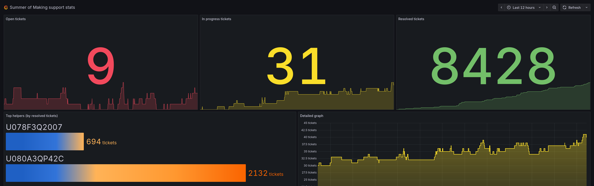

# Support Watcher

> Watches over Helper Heidi to make sure she's okay <3

Support Watcher is a Prometheus exporter that collects statistics about the Summer of Making help channel.

Data provided by [Nephthys](https://nephthys.hackclub.com/), the Summer of Making support bot (also known as Helper Heidi).

## Demo

**[📊 View the demo on grafana.slevel.xyz](https://grafana.slevel.xyz/public-dashboards/d07313df925b4d2eafc84956f5cb72c4?from=now-12h&to=now&timezone=browser)**

[](https://grafana.slevel.xyz/public-dashboards/d07313df925b4d2eafc84956f5cb72c4?from=now-12h&to=now&timezone=browser)

## Run from source

You'll need to have [Rust](https://www.rust-lang.org/tools/install) installed.

1. Clone the repository and `cd` into it
2. Run `cargo run` in your terminal
3. Verify that it works by visiting <http://localhost:9000/metrics> and viewing the metrics

### Add Prometheus

You can ingest the metrics into Prometheus or a compatible time-series database. An example [prometheus.yaml](development/prometheus.yaml) configuration file is provided, which you can use directly or integrate into an existing config. To use the config, install Prometheus and run

```bash
prometheus --config.file=development/prometheus.yaml
```

## Command line options

- `support-watcher` &ndash; Start the exporter on the default port (`9000`)
  - `support-watcher --port <port>` &ndash; Specify a custom port

## Contributing tips

### Working with Docker

#### Build a multi-platform image

1. Set up a Docker BuildKit builder: `docker buildx create --use`
2. Install required emulators: `docker run --privileged --rm tonistiigi/binfmt --install arm64` (if your local machine is x86_64)
   - If you're on an ARM64 machine, you should install the `amd64` emulator instead
   - If you're on another architecture, install both (`arm64,amd64`)
3. Build it! `docker buildx build --platform linux/amd64,linux/arm64 --load .`

#### Build a multi-platform image and upload it to Docker Hub

1. If you're publishing a new version, bump version in `Cargo.toml` and `git tag` the new version
2. Check the [tags already available on Docker Hub](https://hub.docker.com/r/mmk21/support-watcher/tags)
3. Use the [`upload-new-docker-image.sh`](upload-new-docker-image.sh) script! E.g. `./upload-new-docker-image.sh 0.1.9`
   - This will automatically perform the preparatory steps for multi-platform builds (as above), build the image, tag it, and upload it to Docker Hub
